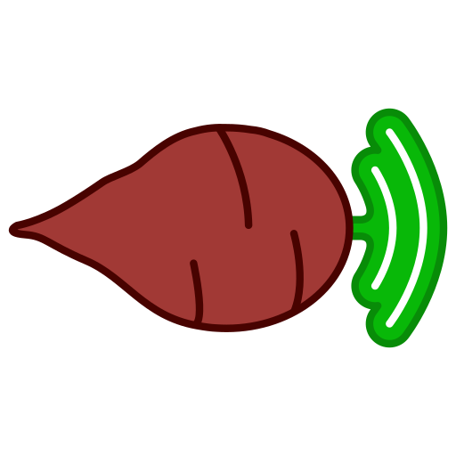

<br />

<div align="center">

  <a href="https://github.com/FlorentLM/BeetstreamNext">
    
  </a>

<h3 align="center">BeetstreamNext</h3>
  <p>
  A modern, feature-rich OpenSubsonic API server for your Beets.io music library.
  <br/>

[](https://opensource.org/licenses/MIT)  

  </p>
</div>

BeetstreamNext is a [Beets.io](https://beets.io) plugin that exposes the [OpenSubsonic API](https://opensubsonic.netlify.app/), allowing you to stream your music library to any Subsonic-compatible client.
I started implementing new features to Beetstream but ended up rewriting a significant part of it, so I figured it'd make more sense to keep it as a distinct project.

Personally, I use Beets to manage my music library but I don't like to write metadata to the files. So with this, I can have the best of both worlds.

## Features

- **OpenSubsonic coverage**: All essential modern endpoints are covered
- **Multi-user system**: Bookmarks, individual ratings, favourites, play statistics, play queues (save/restore your queue across devices)...
- **Authentication**: Supports OpenSubsonic's modern API key authentication, and the legacy MD5 token auth for older clients
- **Transcoding**: On-the-fly transcoding (with FFmpeg). Direct play also available of course.
- **Album artworks / Artists images**: 
    - Grabs and serves the local album art path from your Beets library
    - Can extract embedded album artwork from media files
    - Can use the [Cover Art Archive](https://coverartarchive.org/) to fetch album artworks
    - Can fetch artist images from Deezer
- **More metadata!!**:
    - Can fetch artist info (like biographies, top tracks, similar artists, etc) from Last.fm
    - Fallback to Wikipedia for artists biographies if not from Last.fm
    - Serves internal Beets lyrics or fetches them on-the-fly via the Beets `lyrics` plugin
- **Complex queries**: Beets' advanced queries are supported in the search function. Use regex, fuzzy match, complex filters, etc. directly from your client!
    - Just use the `beets:` (or `b:`) prefix followed by your query: for instance`beets:length:..3:30` will return all songs shorter than 3 minutes 30
    - See Beets' [Queries reference](https://beets.readthedocs.io/en/stable/reference/query.html) for more examples

## Installation

Requires Python 3.10+ and an existing Beets library.

> [!NOTE]
> BeetstreamNext is not yet available on PyPI. Installation currently requires cloning the source code from GitHub.

1.  **Install Beets**: If you haven't already, [install and configure Beets](https://beets.readthedocs.io/en/stable/guides/main.html). You will also need `git` installed on your system.

2. **Install the Plugin**:
   ```bash
   git clone https://github.com/FlorentLM/BeetstreamNext.git
   cd BeetstreamNext
   pip install .
   ```
3. **Enable in Beets' `config.yaml`**:
   ```yaml
   plugins: beetstreamnext
   ```
4. **Create a user**:
   ```bash
   beet beetstreamnext --create-user
   ```
   *Follow the prompts to create your admin account and receive your API Key.*

5. **Run the Server**:
   ```bash
   beet beetstreamnext
   ```

## Configuration

Available options in your Beets `config.yaml`:

```yaml
beetstreamnext:
  host: 0.0.0.0
  port: 8080
  reverse_proxy: false          # Enable if running behind Nginx/Caddy
  
  ip_whitelist: ''              # List of IPs (space or comma-separated) to allow
  ip_blacklist: ''              # List of IPs (space or comma-separated) to block
  
  debug: false                  # Enable to use debug mode (insecure)
  force_trust_host: false       # Enable to allow any host to use debug mode (not recommended)
  
  legacy_auth: false            # Enable to allow old MD5-based password auth (not recommended)
  never_transcode: false        # Force direct stream only (never re-encode files, even if a client requests it)
  
  # Artist images
  fetch_artists_images: true    # Fetch artist photos from Deezer when a client requests them
  save_artists_images: true     # Save fetched artist photos to their respective folders (if they don't exist yet)
  save_album_art: true          # Save fetched album art images to their respective folders (if they don't exist yet)
  
  # Playlists configuration
  playlist_dirs:                # A list of directories to scan for .m3u playlists.
    - '/path/to/my/playlists'
    - '/another/path/for/playlists'
```

### Environment variables

Some features require API keys or secrets, which should be configured as environment variables.
You can place these in a `.env` file in the directory where you run the `beet` command.

- `BEETSTREAMNEXT_KEY`: Secret key used to encrypt legacy passwords at rest.
- `LASTFM_API_KEY`: (Optional) to enable biographies, similar artist discovery, etc.

## Using behind a reverse proxy

BeetstreamNext uses modern standard HTTP headers to know the original client's IP, 
so the configuration should be pretty straightforward.

**Nginx** for instance would look like this:
```
location /beetstreamnext {
    proxy_pass http://127.0.0.1:8080;
    
    proxy_set_header Host $host;
    proxy_set_header X-Real-IP $remote_addr;
    proxy_set_header X-Forwarded-For $proxy_add_x_forwarded_for;
    proxy_set_header X-Forwarded-Proto $scheme;
    
    # If hosting in a subfolder, tell BeetstreamNext what the subfolder is!
    proxy_set_header X-Forwarded-Prefix /beetstreamnext;
}
```

**Caddy** (v2) passes all the required headers by default, so it's just:
```
example.com {
    reverse_proxy 127.0.0.1:8080
}
```

### Web Clients and CORS

By default, BeetstreamNext is configured with CORS (Cross-Origin Resource Sharing) disabled. 
If you use native mobile or desktop apps, you probably do not need to change anything (native apps ignore CORS and will work out of the box).

If you want to use a _web-based_ Subsonic player hosted on a different domain, 
you must allow the web player's URL in your Beets config, otherwise your web browser will block the connection for security reasons.

```yaml
beetstreamnext:
    cors: 'https://app.example.com' # also accepts a comma-separated list or a wildcard '*'
```

If you are using a SSO gateway (Authelia, Authentik, etc.), or if the web-based player is a bit quirky, you might also
need to enable this:

```yaml
beetstreamnext:
    cors_supports_credentials: true
```

**Warning:** DO NOT set `cors: '*'` alongside `cors_supports_credentials: yes`. 
Doing so could allow *any* malicious website you visit to silently interact with your BeetstreamNext server in the background.

## Tested clients

BeetstreamNext should be compatible with virtually any Subsonic/OpenSubsonic client.
I tested it and confirmed it working with:

#### Android
- [Symfonium](https://symfonium.app/)
- [Tempo](https://github.com/CappielloAntonio/tempo)
- [Tempus](https://github.com/eddyizm/tempus)
- [SubTune](https://github.com/TaylorKunZhang/SubTune)
- [GoSonic](https://play.google.com/store/apps/details?id=com.readysteadygosoftware.gosonic)
- [K-19 Player](https://github.com/ulysg/k19-player)
- [Ultrasonic](https://gitlab.com/ultrasonic/ultrasonic)
- [Subtracks](https://github.com/austinried/subtracks)

#### iOS/iPadOS
- [Amperfy](https://github.com/BLeeEZ/amperfy)
- [Submariner](https://github.com/SubmarinerApp/Submariner)
- [Supersonic](https://github.com/dweymouth/supersonic)

#### Desktop
- [Feishin](https://github.com/jeffvli/feishin)
- [Aonsoku](https://github.com/victoralvesf/aonsoku)

## TODO
- [x] User management (create/delete) via the API (instead of CLI only)
- [x] Implement rate limiting
- [x] Move now_playing into the db as a volatile table
- [x] Use MBID instead of artists names for internal ID mapping
- [x] Support multi-artists / contributors / producers / labels properly
- [ ] Make an Admin WebUI panel to manage users
- [ ] Docker image
- [ ] Add scrobbling to Last.fm and other similar services
- [ ] Maybe provide a direct `smartplaylist` query support for virtual playlists

## Missing endpoints

See [here](missing-endpoints.md) a (non-exhaustive) list

## License

This project is licensed under the MIT License. See the `LICENSE` file for details.