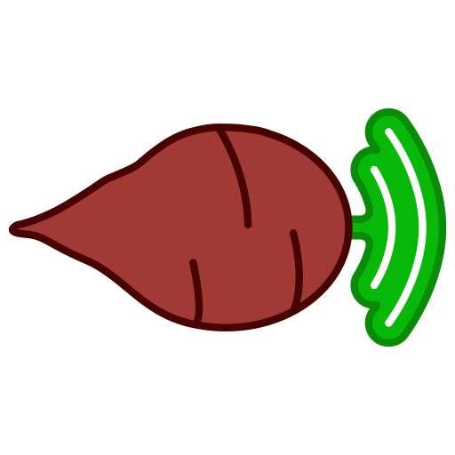

<br />

<div align="center">

  <a href="https://github.com/FlorentLM/BeetstreamNext">
    
  </a>

<h3 align="center">BeetstreamNext</h3>
  <p>
  A fully-featured music server for Beets.io music libraries implementing the OpenSubsonic API.
  <br/>

[](https://opensource.org/licenses/MIT)  

  </p>
</div>

BeetstreamNext exposes your [Beets](https://beets.io) music library over the [OpenSubsonic API](https://opensubsonic.netlify.app/), allowing you to stream your music to any Subsonic/OpenSubsonic/Navidrome client. 

## Screenshots

<p float="left">
    
    
</p>

---

## API coverage & Features

BeetstreamNext supports pretty much **all** of the Subsonic/OpenSubsonic API specification.

Only unsupported features are _video streaming_-related.

It also adds several enhancements and cool features :)

### Core

*   **Authentication:** Supports modern API key authentication and legacy MD5 token authentication for older clients.
*   **Multi-user system:** Individual bookmarks, ratings, favorites, play statistics, and play queues (allowing you to save and restore your active queue across devices).
*   **Advanced Beets queries (search hook):** You can execute complex Beets queries (e.g. regex, field-specific queries, fuzzy matching) directly inside your Subsonic client's search bar. Simply prefix your query with `beets:` or `b:` (e.g. `beets:length:..3:30` to find tracks shorter than 3:30).
*   **Zero-file-modification architecture:** Designed for users who manage metadata inside Beets but do *not* want to modify or write metadata tags directly to their media files, for archival purposes.
*   **Lyrics retrieval:** Serves internal Beets lyrics or fetches them on-the-fly using the Beets `lyrics` plugin.
*   **On-the-fly transcoding:** Serves raw files directly or transcodes lossy/lossless targets on-the-fly using FFmpeg.
*   **HTTP Live Streaming (HLS):** AAC-encoded dynamic HLS streaming with full Adaptive Bitrate (ABR) support for clients that request multi-bitrate variant playlists.
*   **Jukebox mode:** Play audio on the server's own hardware (via `mpv`) or on a Sonos speaker on the local network (via [SoCo](https://github.com/SoCo/SoCo)), controlled remotely from any Subsonic client with jukebox support.

### Library intelligence

*   **Metadata integration:** Retrieves artist biographies, top tracks, and similar artists or songs from Last.fm or Wikipedia, ratings from Discogs, etc.
*   **Album artworks / Artist images:** Grabs and serves the local album art path from your Beets library, or fetches and saves the images from [Cover Art Archive](https://coverartarchive.org/) and Deezer.
*   **Sonic similarity:** Native integration with [AudioMuse-AI](https://github.com/NeptuneHub/AudioMuse-AI) for acoustic similar-song lookups and playlist path-finding between two songs, via OpenSubsonic's `sonicSimilarity` extension.

### Podcasts

*   **Full support:** Per-user subscriptions to podcast RSS feeds, browse channels and episodes, download episodes, etc.

### Sharing

*   **Public shares:** Generates public landing pages for shared files with a secure download endpoint.

### Beets integration

*   **Optional write-back:** Optionally mirrors one user's stars and ratings back into the Beets database as flexible attributes, so they survive outside BeetstreamNext. Fetched song lyrics can also be committed to the beets library.
*   **Remote-triggered scans:** Kick off an incremental `beet import` from a Subsonic client's "scan library" action.

### Reliability & security

*   **Access controls:** CIDR-aware IP whitelisting/blacklisting, plus adaptive login rate-limiting on both per-(IP, username) and per-IP-only buckets to slow down distributed brute-force attempts (monitored and cleared via the admin panel).
*   **Reverse-proxy file offloading:** Supports `X-Accel-Redirect` (Nginx) or `X-Sendfile` (Apache) so direct file serving can bypass the Python process entirely.

### Admin

*   **Admin WebUI:** View live server info, manage settings, users, banned IP lists, etc, from a lightweight web dashboard.

---

## Installation & Deployment

1.  **Clone and Install:**
    ```bash
    git clone https://github.com/FlorentLM/BeetstreamNext.git
    cd BeetstreamNext
    pip install .
    ```
2.  **Enable in Beets' `config.yaml`:**
    ```yaml
    plugins: beetstreamnext
    ```
3.  **Create your admin user:**
    ```bash
    beet beetstreamnext --create-user
    ```
4.  **Run:**
    ```bash
    beet beetstreamnext
    ```

**Optional system dependencies** (must be on `PATH`, or pointed to explicitly via `ffmpeg_path`/`mpv_path`, see [Configuration](#configuration)):
*   [`ffmpeg`](https://ffmpeg.org/) for on-the-fly transcoding and HLS streaming.
*   [`mpv`](https://mpv.io/) for jukebox mode with the `mpv` backend (playing audio on the server's own hardware). Not needed if you use the `sonos` backend, or don't use jukebox mode at all.

**Optional Python dependencies** (`pip install .[extra]`, or add to Poetry's `--extras`):
*   `sonos`: pulls in [SoCo](https://github.com/SoCo/SoCo), needed for jukebox mode with the `sonos` backend (playing audio on a Sonos speaker).

---

## Configuration

Settings can be managed initially via Beets' `config.yaml`, and subsequently adjusted directly inside the Admin WebUI (which takes precedence).

```yaml
beetstreamnext:
  host: 0.0.0.0                 # Or a list (e.g. [192.168.1.10, 100.64.0.5]) to bind only specific interfaces
  port: 8080
  reverse_proxy: false          # Enable if running behind Nginx/Caddy
  
  # Network & Access restrictions
  admin_hostname: ''            # Restrict admin panel to this host (e.g., admin.local)
  external_hostname: ''         # Force public shares to generate with this domain name
  ip_whitelist: ''              # List of IPs (space or comma-separated) to allow
  ip_blacklist: ''              # List of IPs (space or comma-separated) to block
  cors: ''                      # Allowed CORS origins for web-based clients
  
  # Library options
  enable_public_now_playing: false  # Toggle the public homepage widget
  fetch_artists_images: true        # Fetch artist photos from Deezer
  save_artists_images: true         # Save fetched artist photos to music folders
  save_album_art: true              # Save fetched album art to music folders

  # Podcasts
  podcast_storage_dir: ''           # Where to store downloaded episodes (defaults to the cache location)
  podcast_auto_download_count: 10   # Number of episodes to auto-download when a channel is added (0 to disable)

  # Audio
  ffmpeg_path: ''                   # Path to the ffmpeg binary, if not on PATH
  jukebox_allowed: false            # Allow jukebox mode (server plays audio on its own hardware, or on a Sonos speaker)
  jukebox_backend: 'mpv'            # 'mpv' (server's own hardware) or 'sonos' (a Sonos speaker on the local network)
  mpv_path: ''                      # mpv backend: path to the mpv binary, if not on PATH
  jukebox_hardware_device: ''       # mpv backend: mpv --audio-device value (e.g. 'alsa/hw:0,0'), empty = system default
  jukebox_sonos_ip: ''              # sonos backend: IP of the selected speaker (set via 'Discover speakers' in the admin panel)
```

### Environment variables
*   `BEETSTREAMNEXT_KEY`: Secret key used to encrypt legacy passwords at rest.
*   `LASTFM_API_KEY`: (Optional) To enable biographies, top tracks, and similar artist queries.

## Using behind a reverse proxy

BeetstreamNext uses modern standard HTTP headers to know the original client's IP, 
so the configuration should be pretty straightforward.

**Nginx** for instance would look like this:
```
location /beetstreamnext {
    proxy_pass http://127.0.0.1:8080;
    
    proxy_set_header Host $host;
    proxy_set_header X-Real-IP $remote_addr;
    proxy_set_header X-Forwarded-For $proxy_add_x_forwarded_for;
    proxy_set_header X-Forwarded-Proto $scheme;
    
    # If hosting in a subfolder, tell BeetstreamNext what the subfolder is!
    proxy_set_header X-Forwarded-Prefix /beetstreamnext;
}
```

**Caddy** (v2) passes all the required headers by default, so it's just:
```
example.com {
    reverse_proxy 127.0.0.1:8080
}
```

### Web Clients and CORS

By default, BeetstreamNext is configured with CORS (Cross-Origin Resource Sharing) disabled. 
If you use native mobile or desktop apps, you probably do not need to change anything (native apps ignore CORS and will work out of the box).

If you want to use a _web-based_ Subsonic player hosted on a different domain, 
you must allow the web player's URL in your Beets config, otherwise your web browser will block the connection for security reasons.

```yaml
beetstreamnext:
    cors: 'https://music.example.com' # also accepts a comma-separated list or a wildcard '*'
```

If you are using a SSO gateway (Authelia, Authentik, etc.), or if the web-based player is a bit quirky, you might also
need to enable this:

```yaml
beetstreamnext:
    cors_supports_credentials: true
```

**Warning:** DO NOT set `cors: '*'` alongside `cors_supports_credentials: yes`. 
Doing so could allow *any* malicious website you visit to silently interact with your BeetstreamNext server in the background.

---

## Tested clients

BeetstreamNext should be compatible with virtually any Subsonic/OpenSubsonic client.
I tested it and confirmed it working with:

#### Android
- [Substreamer](https://github.com/ghenry22/substreamer)
- [Agin Music](https://github.com/aginrocks/agin-music-mobile)
- [Amcfy Music](https://www.amcfy.com/)
- [Symfonium](https://symfonium.app/)
- [Tempo](https://github.com/CappielloAntonio/tempo)
- [Tempus](https://github.com/eddyizm/tempus)
- [SubTune](https://github.com/TaylorKunZhang/SubTune)
- [GoSonic](https://play.google.com/store/apps/details?id=com.readysteadygosoftware.gosonic)
- [K-19 Player](https://github.com/ulysg/k19-player)
- [Ultrasonic](https://gitlab.com/ultrasonic/ultrasonic)

#### iOS/iPadOS
- [Amperfy](https://github.com/BLeeEZ/amperfy)
- [Submariner](https://github.com/SubmarinerApp/Submariner)
- [Supersonic](https://github.com/dweymouth/supersonic)

#### Desktop
- [Feishin](https://github.com/jeffvli/feishin)
- [Aonsoku](https://github.com/victoralvesf/aonsoku)

---

## Missing endpoints

None, except video-streaming-related (see [here](OpenSubsonic_endpoints.md))

---

## License

This project is licensed under the MIT License. See the `LICENSE` file for details.