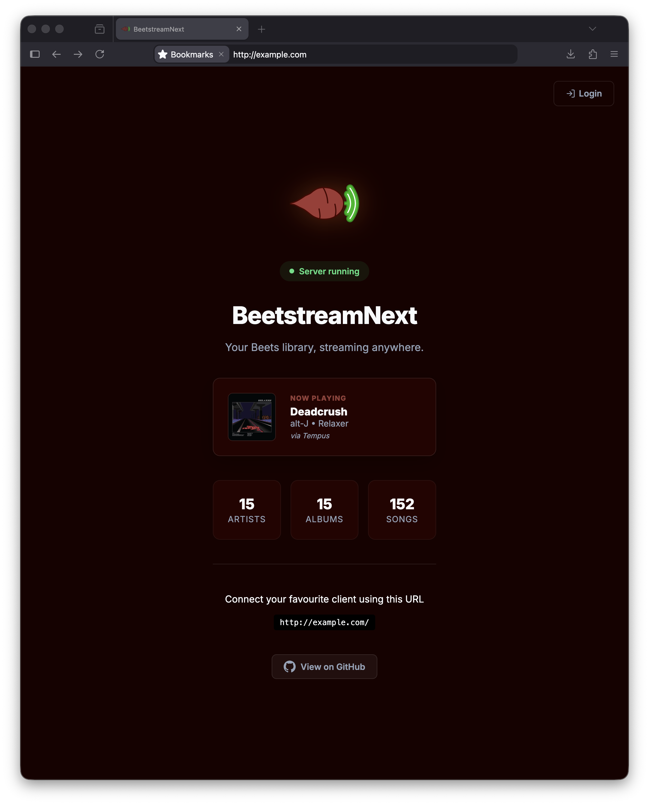
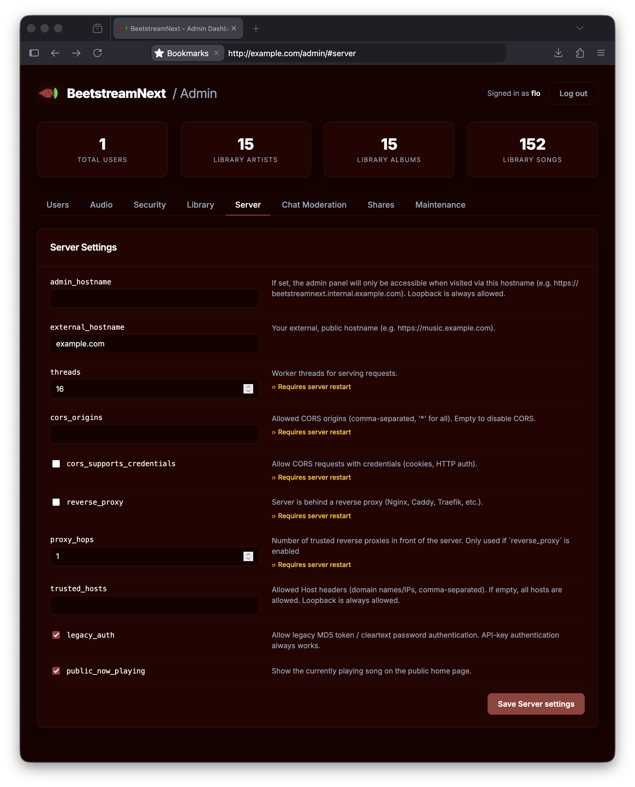

<br/>

<div align="center">

<a href="https://github.com/FlorentLM/BeetstreamNext">

</a>

<h3 align="center">BeetstreamNext</h3>
<p>
Fully-featured music server for Beets.io music libraries implementing the OpenSubsonic API
<br/>

[](https://opensource.org/licenses/MIT)

</p>

</div>

BeetstreamNext exposes your [Beets](https://beets.io) music library over the [OpenSubsonic API](https://opensubsonic.netlify.app/), letting you stream your music to any Subsonic/OpenSubsonic/Navidrome client. It supports essentially the whole specification (only video-streaming is left out), and adds a bunch of its own extras :)

<div align="center">


</div>


## Features

- **Multi-user accounts**: per-user bookmarks, ratings, favorites, play queues... ([details](https://florentlm.github.io/BeetstreamNext/features/accounts-and-permissions.html))
- **Streaming**: direct play, on-the-fly transcoding, adaptive-bitrate HLS, server-side ReplayGain, self-healing streams ([details](https://florentlm.github.io/BeetstreamNext/features/streaming.html))
- **Jukebox mode**: play on the server's own hardware, a Sonos speaker, or a Chromecast device ([details](https://florentlm.github.io/BeetstreamNext/features/jukebox.html))
- **Library augmentation**: artist bios, similar artists/songs, ratings, lyrics, sonic similarity ([details](https://florentlm.github.io/BeetstreamNext/features/library-augmentation.html))
- **Internet radio & podcasts**, managed independently of your Beets library ([details](https://florentlm.github.io/BeetstreamNext/features/radio-and-podcasts.html))
- **Playlists**: BeetstreamNext's own per-user playlists, plus read/write access to Beets' `playlist`/`smartplaylist` files ([details](https://florentlm.github.io/BeetstreamNext/features/playlists.html))
- **Public shares**: landing pages and download links, no client or account required ([details](https://florentlm.github.io/BeetstreamNext/features/public-shares.html))
- **Security**: IP allow/deny lists, adaptive rate-limiting ([details](https://florentlm.github.io/BeetstreamNext/features/security.html))
- **Advanced Beets queries**: prefix a client search with `beets:`/`b:` to run a full Beets query instead of a simple search

## Documentation

**[Read the full docs](https://florentlm.github.io/BeetstreamNext/)** for installation (as a **Beets plugin**, or in **standalone** mode), configuration reference, all features in detail, API coverage, reverse-proxy/CORS setup, and tested clients.

## Quick start

```bash
git clone https://github.com/FlorentLM/BeetstreamNext.git
cd BeetstreamNext
pip install .
```

Enable it in Beets' `config.yaml`:

```yaml
plugins: beetstreamnext
```

Then run it:

```bash
beet beetstreamnext
```

BeetstreamNext can also run standalone, see [Installation](https://florentlm.github.io/BeetstreamNext/installation.html).

## License

This project is licensed under the MIT License. See the `LICENSE` file for details.
