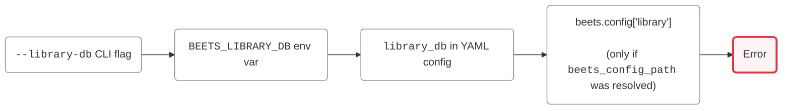
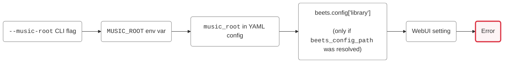

# Installation

**BeetstreamNext** can run in two modes:

- **Plugin mode**: Attaches to an existing [Beets](https://beets.io) install and reuses its `config.yaml`.
- **Standalone mode**: Runs in its own process, pointed directly at a `library.db` (still `beets`-managed, just not invoked _as_ a Beets plugin). Useful when Beets lives in a different container or host than **BeetstreamNext**.

Both existing modes share the same [feature set](./features/index.md) and [settings](./configuration.md), only how you configure and launch the server differ slightly.

## Requirements

- Python 3.13+
- [**Beets**](https://beets.readthedocs.io/en/stable/guides/main.html) installed
  - **Plugin mode** needs a working Beets install with a library you already import music into.
  - **Standalone mode** needs `beets` available as a Python package (for its query engine and file-path handling).
- [`ffmpeg`](https://ffmpeg.org/) installed and available on `PATH`
- Optionally, [`mpv`](https://mpv.io/) installed and available on `PATH` for jukebox mode using the server's own audio hardware (not needed for the `sonos`/`chromecast` jukebox backends, or if you don't use jukebox mode. See [Jukebox](./features/jukebox.md) info).

> **Note:** Both `ffmpeg` and `mpv` binaries can be pointed to explicitly via the `ffmpeg_path`/`mpv_path` settings if they aren't on your `PATH`.

> **Note:** These requirements are for running from source. If you run **BeetstreamNext** via the [Docker image](#docker) instead, everything is already bundled with it.

## Running from source

### 1. Clone and install:

```bash
git clone https://github.com/FlorentLM/BeetstreamNext.git
pip install BeetstreamNext
````

or if you installed Beets via the recommended `uv tool` command:

```bash
git clone https://github.com/FlorentLM/BeetstreamNext.git
uv tool install beets --with ./BeetstreamNext --reinstall
````

Optional extras add the dependencies for specific features:

```bash
pip install .[wiki]              # Wikipedia artist-biographies (using wikipedia-api)
pip install .[podcasts]          # Podcast support (using feedparser for the RSS feeds)
pip install .[podcast-discovery] # Podcast channel discovery (using the Podcast Index API)
pip install .[radio-discovery]   # Internet radio station discovery (using the Radio Browser API)
pip install .[sonos]             # Sonos speaker jukebox backend (using SoCo)
pip install .[chromecast]        # Chromecast jukebox backend (using pychromecast)
```

or 

```bash
pip install .[all]               # Installs all optional dependencies
```

(With `uv`, use for instance `uv sync --extra podcasts`, or `uv sync --extra all`)

This installs a `beetstreamnext` console command (used by **standalone mode**) alongside the `beetstreamnext` Beets plugin (used by **plugin mode**).

### 2. Configure and run

#### Plugin mode

Add `beetstreamnext` to the `plugins` line in Beets' `config.yaml`, and put any **BeetstreamNext** settings under a `beetstreamnext:` block in that file:

```yaml
plugins: beetstreamnext

beetstreamnext:
  port: 8080
```

See the [configuration reference](./configuration.md) for the full list of available settings.

Then just run it through `beet`'s own subcommand:

```bash
beet beetstreamnext
```

Plugin-mode flags:

`--create-user`, `--update-user USERNAME`, `--delete-user USERNAME`, `--password USERNAME`, `--list-users`, `--clear-cache`, plus `--host`/`--port`/`--threads`/`--debug` to override those settings for a single run.

See [CLI usage](./usage/cli.md#plugin-mode) for the full command reference.

#### Standalone mode

Standalone mode resolves its Beets library path (`library-db`) and music root (`music-root`) following a specific order:

- `library_db`:



- `music_root`:



Every other setting follows the (roughly similar) order defined in [Configuration](./configuration.md), and can also be set from the Admin panel (except `library_path`, see **Note** below).

> **Note:** Since `--library-db`/`BEETS_LIBRARY_DB`/`library_db` (in the YAML) is required on every run just to locate BeetstreamNext's database, there's no scenario where it isn't explicitly set, so it is currently never editable in the WebUI (I might revise this).

At minimum, you should point **BeetstreamNext** to your `library.db` and music root:

```bash
beetstreamnext run --library-db /path/to/library.db --music-root /path/to/music
```

Or via a YAML config file, pass `--config`, or just put your configuration file at the default location for your platform:

- Docker: `/config/beetstreamnext.yaml`
- Linux/macOS: `$XDG_CONFIG_HOME/beetstreamnext/beetstreamnext.yaml` (usually `~/.config/beetstreamnext/beetstreamnext.yaml`)
- Windows: `%APPDATA%\beetstreamnext\beetstreamnext.yaml`

```yaml
# beetstreamnext.yaml
library_db: /path/to/library.db
music_root: /path/to/music
port: 8080
```

```bash
beetstreamnext run --config /path/to/beetstreamnext.yaml
```

You can also use environment variables (handy for containers):

```bash
export BEETS_LIBRARY_DB=/path/to/library.db
export MUSIC_ROOT=/path/to/music
beetstreamnext run
```

Standalone subcommands:

`create-user`, `update-user USERNAME`, `delete-user USERNAME`, `passwd USERNAME`, `list-users`, `clear-cache`

See [CLI usage](./usage/cli.md#standalone-mode) for the full flag list (`--bsn-db`, `--beets-config`, `--host`, `--port`, `--threads`, `--debug`, `--force-trust-host`).

> **Note:** If a Beets config file passed via `--beets-config` contains a `beetstreamnext:` section, it will be _ignored_ in standalone mode. Put those settings in a dedicated BeetstreamNext `--config` YAML file, or `BSN_*` environment variables, or set them via the Admin WebUI.

## Run via Docker

A prebuilt image is published to GitHub Container Registry (GHCR):

`ghcr.io/florentlm/beetstreamnext:latest` (or use a specific version tag if you wish, e.g. `:2.0.0`).

Minimal example command:

```bash
docker run -d --name beetstreamnext \
  --restart unless-stopped \
  -p 8080:8080 \
  -e PUID=1000 -e PGID=1000 \
  -v /path/to/config:/config \
  -v /path/to/library.db:/data/library.db:ro \
  -v /path/to/music:/music:ro \
  -e BEETS_LIBRARY_DB=/data/library.db \
  -e MUSIC_ROOT=/music \
  ghcr.io/florentlm/beetstreamnext:latest
```

If you need something the default image doesn't give you (a non-default [feature-set extra](#1-clone-and-install), a specific pinned `beets` version, debug tools, etc), you should build it yourself instead using the `Dockerfile` available at the repository root.

Example:

```bash
docker build -t beetstreamnext --build-arg BEETS_VERSION=2.11.0 .
```

Build-time options (`--build-arg`):

- `EXTRAS` _(default_ `all`_)_: which optional feature sets to install, comma-separated. Same list as [above](#1-clone-and-install): `wiki`, `podcasts`, `podcast-discovery`, `radio-discovery`, `sonos`, `chromecast`, or `all`.

- `PYTHON_VERSION` _(default_ `3.13`_)_: Python version to use instead of the one defined in `pyproject.toml`.

- `BEETS_VERSION`: `beets` to use instead of the one defined in `pyproject.toml`.

- `WITH_MPV` _(default_ `true`_)_: install `mpv` (needed for the `server_hardware` jukebox backend, see [Jukebox mode](./features/jukebox.md#running-in-docker)). You can set to `false` if you don't use that backend and want a smaller image.

- `WITH_DEBUG_TOOLS` _(default_ `false`_)_: also install `curl`, `wget`, `ping`, `dig`/`nslookup`, `nc`, and `ip`/`ss`, for poking at networking issues from inside the container (e.g. `docker exec -it beetstreamnext curl ...`).

### Image paths

- `/config` contains:
  - the `beetstreamnext.yaml` configuration file
  - the `.env` file (holding `BEETSTREAMNEXT_KEY`, see [Encryption key](#3-encryption-key))
  - the BeetstreamNext database (`beetstreamnext.db`)
  - a `data/` subfolder: contains downloaded podcast episodes, and saved artist images

- `/cache` is scratch space, with two subfolders:
  - `data`: thumbnails, HTTP cache, session key
  - `tmp`: transcode tempfiles, HLS sessions, zip downloads, SQLite/Python tempfiles

> **Note:** The `data` cache subfolder is worth bind-mounting to keep the data across containers restarts. The `tmp` subfolder is fine to discard, but you can bind-mount it if you want the cache to survive restarts. Mounting them separately is useful if you want different backing storage for each (see [hardening the container](#advanced-hardening-the-container) below).

### Other image options

`PUID`/`PGID` (default `1000`/`1000`): these should match the user that owns your library/music files on the host.

> **Note:** BeetstreamNext never runs as root. The root user is only used at container start, to `chown` `/config` and `/cache` to that `PUID`/`PGID` before dropping to it for the rest of the process's life.

> **Note:** If you want to control the folders' ownership yourself, you can also run the container as a specific user directly (use `docker run --user UID:GID`, in which case also make sure `/config` is already owned by that user), and the entrypoint will notice and won't try to switch users itself.

## Run via docker-compose

There's a [`docker-compose.yml`](https://github.com/FlorentLM/BeetstreamNext/blob/main/docker-compose.yml) at the repository root equivalent to the `docker run` command above (**BeetstreamNext** only, pulling the published image by default).

Edit the two host paths in it, then:

```bash
docker compose up -d
```

To build locally instead, comment out the `image:` line and uncomment `build: .`.

### Example stack: BeetstreamNext + Betanin

A small stack pairing BeetstreamNext with [**Betanin**](https://github.com/sentriz/betanin), a web UI that drives `beet import`. In this example, **Betanin** owns the beets config and `library.db`, **BeetstreamNext** only ever reads them.

The two containers need to share:

- The beets home directory (`config.yaml` + `library.db`): needs to be read-write for **Betanin**, but can be read-only for **BeetstreamNext**
- The music directory: can be read-only for both

> **Note:** Concurrent SQLite access to `library.db` is only reliable _on a real shared filesystem or bind-mount_ (same host, sharing a named volume). If Betanin and BeetstreamNext are on different hosts, do _not_ mount `library.db` over NFS/SMB, SQLite's file locking isn't reliable over most network filesystem protocols.

This example assumes it is saved as `docker-compose.yml` at the root of a BeetstreamNext checkout (`build: .` needs the `Dockerfile` there).

```yaml
services:
  betanin:
    image: sentriz/betanin
    container_name: betanin
    restart: unless-stopped
    ports:
      - "9393:9393"
    environment:
      UID: "1000"
      GID: "1000"
    volumes:
      - betanin-data:/b/.local/share/betanin
      - betanin-config:/b/.config/betanin
      - beets-home:/b/.config/beets   # shared with BeetstreamNext
      - /path/to/music:/music
      - /path/to/downloads:/downloads

  beetstreamnext:
    # You need to build the image locally if you want to pin BEETS_VERSION to match Betanin (see note below)
    build:
      context: .
      args:
        BEETS_VERSION: 2.11.0    # Betanin currently uses beets 2.11.0
    container_name: beetstreamnext
    restart: unless-stopped
    depends_on:
      - betanin
    ports:
      - "8080:8080"
    environment:
      PUID: "1000"
      PGID: "1000"
      BEETS_LIBRARY_DB: /beets/library.db
      MUSIC_ROOT: /music
    volumes:
      - beetstreamnext-config:/config
      - beets-home:/beets:ro          # same volume as Betanin's /b/.config/beets (read-only here)
      - /path/to/music:/music:ro      # same host path as Betanin's /music (read-only here)

volumes:
  betanin-data:
  betanin-config:
  beets-home:
  beetstreamnext-config:
```

> **Note:** You can run `docker exec betanin beet version` (or whatever your Betanin container is called) to see which version of beets it is using.

Edit the two `/path/to/...` host paths, then `docker compose up -d`.

Open **Betanin** at `:9393` to configure/run imports, and **BeetstreamNext** at `:8080`.

> **Note:** Because the music folder and library are mounted `:ro` for BeetstreamNext here, the admin panel will show a red "read-only" pill next to any setting that would otherwise write to them (see [Configuration reference](./configuration.md)).

### Remapping paths

Beets stores track paths in `library.db` as a relative path to the `directory` value in its YAML config file, exactly as they were seen by the `beet import`/`beet update` process.

In the example above, `beet` is in the `betanin` container, but it could just as well be on a different machine entirely. The compose file example above avoids any issue by mounting the one music directory (on the host) at an identical path in both containers (`/music`).

If you can't (or don't want to) use the same path in both, you can use `music_root` with `library_remote_path`:

- `music_root`: where **BeetstreamNext** sees mounts the music volume

- `library_remote_path`: where the container/machine that owns the library sees that same folder

BeetstreamNext will then substitute one prefix for the other on every path it reads from the library.

So, for instance, a `/downloads/music/Artist/Album/01.flac` path in `library.db` would resolve to `/music/Artist/Album/01.flac` in **BeetstreamNext**'s container.

Example:

```yaml
services:
  betanin:
    volumes:
      - /some/path/to/your/music:/downloads/music   # Betanin's convention
      # ...

  beetstreamnext:
    environment:
      MUSIC_ROOT: /music
      BSN_LIBRARY_REMOTE_PATH: /downloads/music
      # ...
    volumes:
      - /some/path/to/your/music:/music:ro   # Same host path, different mount point
      # ...
```

### Adding an Nginx sidecar for offloading file serving

To offload file serving with an an Nginx sidecar, remove `ports: - "8080:8080"` from the `beetstreamnext` service (Nginx is the one that publishes to the host), then add:

```yaml
  nginx:
    image: nginx:1.27-alpine
    container_name: nginx
    restart: unless-stopped
    depends_on:
      - beetstreamnext
    ports:
      - "8080:8080"
    volumes:
      - /path/to/nginx.conf:/etc/nginx/nginx.conf:ro
      - /path/to/music:/music:ro   # Same host path as beetstreamnext's /music above
```

**BeetstreamNext** also needs `reverse_proxy: true` and `sendfile_method: x-accel-redirect`.

See the [Full working example: Nginx sidecar for a Docker deployment](./reverse-proxy.md#full-working-example-nginx-sidecar-for-a-docker-deployment) for the matching `nginx.conf`.

Other standalone subcommands work by overriding the container's command. For example, an [unattended first run](#unattended-first-run):

```bash
docker run --rm \
  -e BSN_ADMIN_USER=admin -e BSN_ADMIN_PASSWORD=hunter2 \
  -e BEETS_LIBRARY_DB=/data/library.db \
  -v /path/to/config:/config \
  -v /path/to/library.db:/data/library.db:ro \
  beetstreamnext create-user --noinput
```

> **Note:** here `-v /path/to/config:/config` must point at the _same host path_ as what you'll use in the main `run` command (the encryption key and the user this creates both get stored under `/config`, so the two runs need to share it to see the same user/key).

> **Note:** When using Docker, you probably want to use Docker secrets. You can add the `BSN_NO_KEY_FILE=1` to that command to prevent it from writing the `.env` file (see [unattended first run](#unattended-first-run)).

#### Advanced: hardening the container

There are some compose/`docker run` hardening options people like to enable.

- **`read_only: true`**

Makes the whole container filesystem read-only except explicitly mounted volumes. `/config` is already a normal writable volume mount, but if you're not mounting `/cache`, you need to give it a `tmpfs` mount:

```yaml
read_only: true
tmpfs:
  - /cache:mode=1777
```

> **Note:** a `tmpfs` mount lives in RAM and is counted against the container's memory limit (`deploy.resources.limits.memory`), and can't be reclaimed under memory pressure. If you have a big library, a full scan can make SQLite write sizeable temp files into `/cache`, which may trigger SQLite disk I/O errors. Either give the tmpfs an explicit size (`/cache:mode=1777,size=256m`) _and_ raise the container's memory limit, or mount `/cache` as a normal volume instead.

Since `/cache` is split into `/cache/data` and `/cache/tmp`, you can also mount just the `tmp` half as `tmpfs` and leave `data` as a normal volume, so the cache survives restarts but the write-heavy half still gets RAM speed:

```yaml
volumes:
  - /path/to/cache/data:/cache/data
read_only: true
tmpfs:
  - /cache/tmp:mode=1777,size=256m
```

- **`cap_drop: [ALL]`**

The container needs none of the default capabilities so you can drop them all.

```yaml
cap_drop:
  - ALL
```

The entrypoint with the default user needs some of them briefly though, so you need to add:

```yaml
cap_add:
  - CHOWN         # To chown /config and /cache to PUID:PGID
  - SETUID        # To switch from root to PUID
  - SETGID        # To switch from root to PGID
  - DAC_OVERRIDE  # Needed for the above two to work on files that are not already owned by PUID/PGID
```

...unless you use a custom user:

- **`user: PUID:GID`**

If you're using a custom user, the entrypoint doesn't need any special capabilities so you can just do:

```yaml
user: "1000:1000"
cap_drop:
  - ALL
```

> **Note:** The `/config` and `/cache` mounts need to already be owned by that same UID/GID on the host *before* the container starts.

- **`security_opt: [no-new-privileges:true]`**

Stops any process in the container from gaining privileges beyond what it started with. It doesn't interact with anything else BeetstreamNext does, so there's no reason not to set it regardless of which other options above you use.

```yaml
security_opt:
  - no-new-privileges:true
```

- **`deploy.resources.limits`**

**memory:** Caps the _container's total memory_. If you're using `read_only` + `tmpfs` above: a `tmpfs` mount counts against this limit and can't be reclaimed under memory pressure, so size it comfortably above your `tmpfs` size plus BeetstreamNext's normal usage, or a large library scan can fail with what looks like a SQLite disk I/O error.

```yaml
deploy:
  resources:
    limits:
      memory: 512m   # or even 1014 if your library is large
      pids: 100
```

**pids**: Caps the number of processes/threads the container can create, as defense against a fork bomb or some runaway process spawning from a bug or a compromised dependency.

```yaml
pids_limit: 100
```

## Encryption key

User passwords aren't hashed, they are stored _reversibly encrypted_, because Subsonic's legacy MD5-token auth requires the server to recompute `md5(password + salt)` on every login, which needs the plaintext password to be recoverable...

The server key `BEETSTREAMNEXT_KEY` is that database encryption key.

This is meant to protect against the database file leaking on its own: a backup that includes `library.db`/`beetstreamnext.db` but not the dotfiles, a misconfigured endpoint serving the db file, a db copied to a new host without also copying its key ...this sort of thing.

Given that, how the server key is provisioned matters:

- **You have secrets management** (Docker secrets, systemd `LoadCredential`, Vault, a k8s Secret, etc): Set `BEETSTREAMNEXT_KEY` as an environment variable *before* the first run. **BeetstreamNext** detects it and uses it. It's never written to disk.

- **You don't have secrets management**: On first run, **BeetstreamNext** generates a new key, prints it _once_, and saves it to a `.env` file next to your database. Keep that file safe: set restrictive permissions if your platform doesn't already (it's created with `0600`), and make sure it's excluded from anywhere the database itself isn't equally protected.

If the key is lost, stored passwords become unrecoverable and you will need to delete the **BeetstreamNext** database and set up again (of course your Beets library stays perfectly fine).

> **Note:** You also need this server key during the first-run admin account creation if using the Web UI (see below).

## First run

The first time the server starts with no users in the database, it walks you through creating the initial admin account:

- **Running interactively in a terminal**: you're prompted right there for a username and password, and the account is created automatically as an admin.

- **Running non-interactively** (a service manager, a container, anything without a TTY attached): Accessing the Web UI directs you to a setup wizard. That page will ask for the `BEETSTREAMNEXT_KEY` from the step above (this is to prevent letting anyone else who accesses the web UI from setting up the account before you do).

- **Fully unattended** (for instance a Docker container with no TTY and nobody to click through a setup page): *before* starting the server, run once `create-user --noinput` (with `BSN_ADMIN_USER`/`BSN_ADMIN_PASSWORD` set). See [below](#unattended-first-run).

Either way, the admin user account's API key is shown _once_. **Save it**. It's what you'll enter into a Subsonic client instead of a password when using API-key authentication.

Once at least one user exists, use `--create-user`/`create-user` (or the admin panel's Users tab) to create other user accounts.

### Unattended first run

You can setup the first admin account in a completely unattended way by using `--noinput` with the `create-user` command.

This reads the `BSN_ADMIN_USER`/`BSN_ADMIN_PASSWORD` env vars, creates that admin account, prints its API-key, and exits immediately (it doesn't start the server).

You can also add `BSN_NO_KEY_FILE=1` to prevent it from writing the `.env` file containing the `BEETSTREAMNEXT_KEY` server key.

Example:

```bash
BSN_ADMIN_USER=admin BSN_ADMIN_PASSWORD=hunter2 beet beetstreamnext --create-user --noinput
```

(obviously replace `admin` and `hunter2` by your chosen admin username and password)

> **Note:** This is a _one-time_ step. It will refuse to run if any user account already exists.

## Startup

By default the server listens on `0.0.0.0:8080`. Open `http://<host>:8080` to see the public homepage, where you can log into the admin dashboard (see [Web UI usage](usage/webui.md)).

Point any Subsonic/OpenSubsonic/Navidrome client (see [tested clients](./clients.md)) at that same address. You can use the admin account directly, or a non-admin user account you create afterwards if you wish.

---

See the [configuration reference](../configuration.md) for any of the settings mentioned here.
