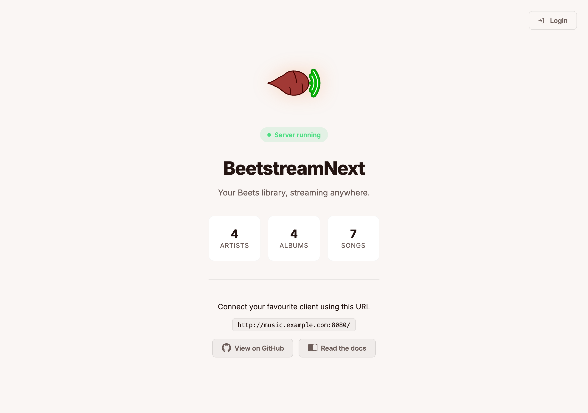
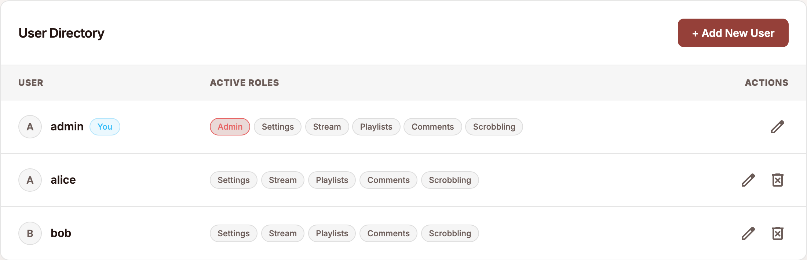
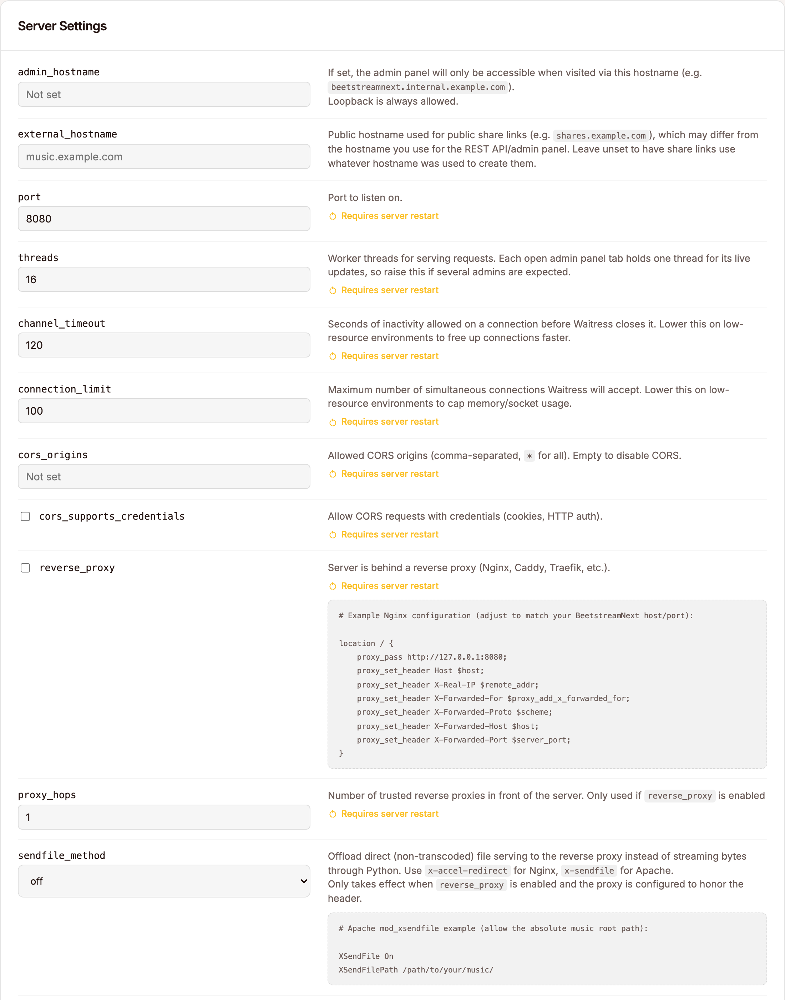
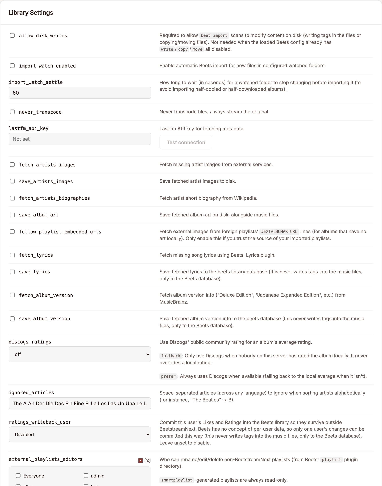
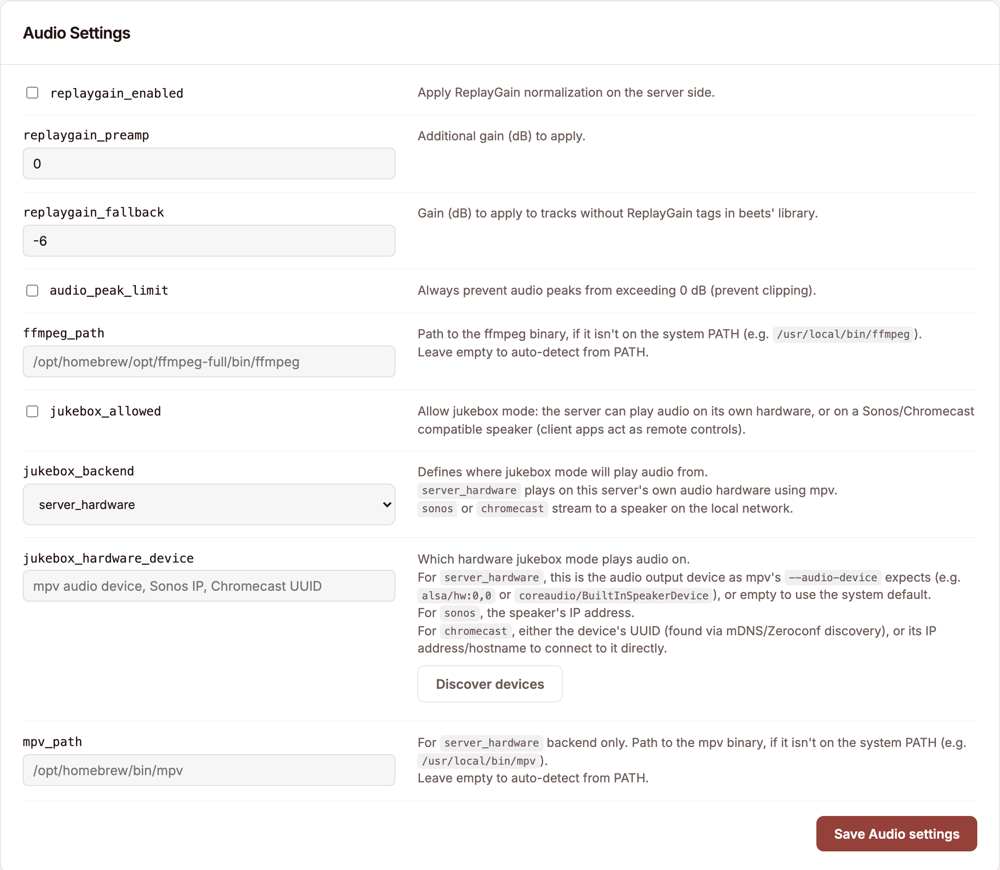
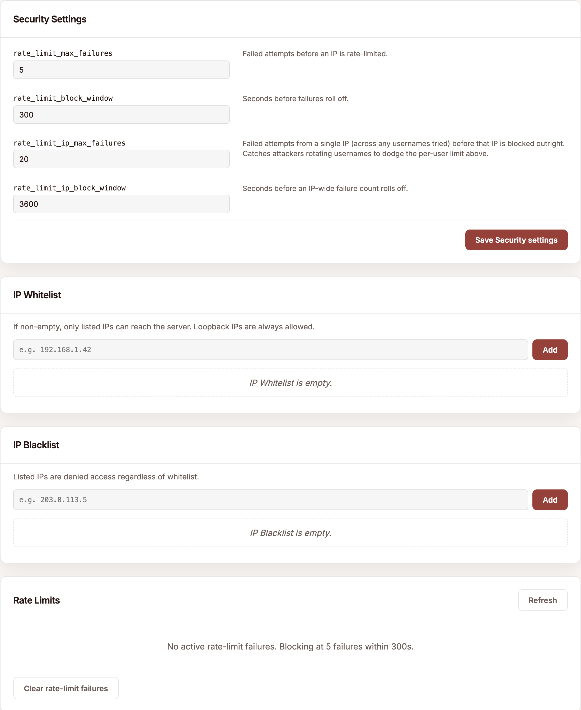
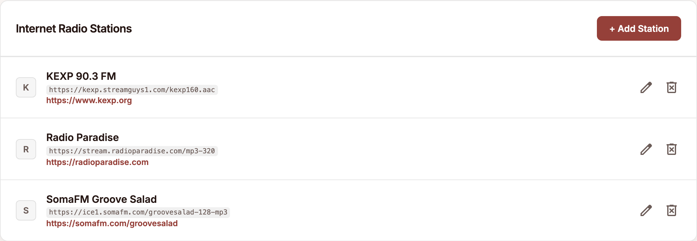
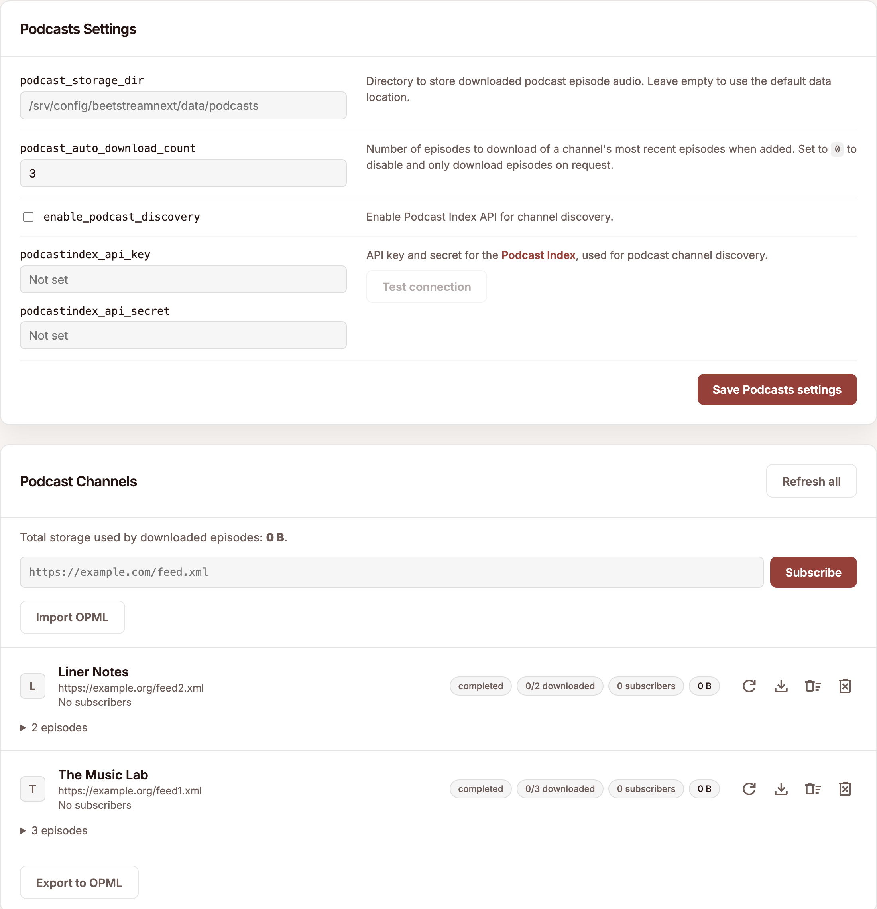
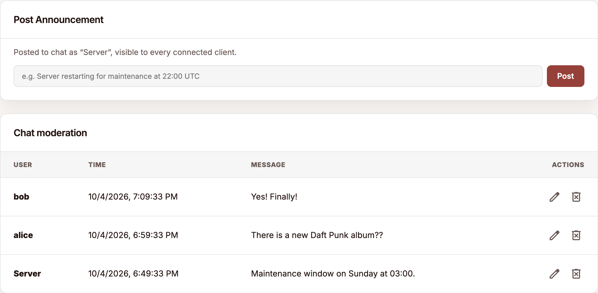
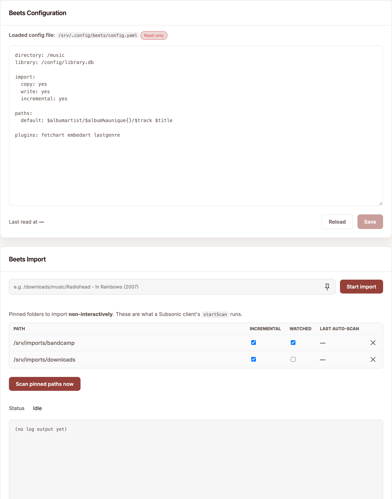

# Web UI

The Web UI is mostly self-explanatory so this is just a quick tour, plus the handful of things that are only reachable through it (that is, not exposed to Subsonic clients).

## Public homepage

Your configured `http://<host>:<port>/` (or your `external_hostname`) shows a public homepage.

If `public_now_playing` is enabled, a card displays the currently playing track (_off_ by default).

## Public shares

TODO

## Admin dashboard

The dashboard is organized into tabs. Most settings are editable live, those that require a server restart to take effect are clearly marked.

A setting that is already pinned by a CLI flag, an environment variable, or a `config.yaml` value shows as _locked_/_disabled_ from the Web UI.

See [Configuration reference](../configuration.md) for the precedence rules.

### Users

Create/update/delete users, toggle their [roles](../features/accounts-and-permissions.md#roles), regenerate an API key, and manage avatars.

### Server

Every [Server & Network](../configuration.md#server--network) related setting.

### Library

Every [Library & Metadata](../configuration.md#library--metadata) related setting.

### Audio

Every [Audio & Jukebox](../configuration.md#audio--jukebox) related setting.

### Security

Live view of the current _IP allow/deny_ lists and _rate-limit_ state (see [Security](../features/security.md)). Allows adding/removing entries, and clearing rate-limit buckets.

### Podcasts & radio

Add/refresh/delete podcast subscriptions and internet radio stations.

[Radio discovery](../features/radio-and-podcasts.md#internet-radio) (when `enable_radio_discovery` is on) allows you to find new stations.

### Shares

View and revoke any active [public share](../features/public-shares.md).

### Chat moderation

View the full chat log, edit/delete any user's message for moderation, or post server announcements.

### Beets

Interact with the Beets installation: view/update Beets' `config.yaml` and run imports (interactive, pinned and watched folders).

See [Beets import](../features/beets-import.md) for the details.

### Maintenance

Trigger a library health scan (see [Encoding errors detection & self-healing streams](../features/streaming.md#encoding-errors-detection--self-healing-streams)), cleanup BeetstreamNext's database, clear disk caches, and view the server logs.

